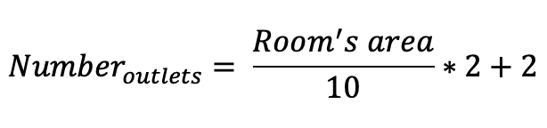
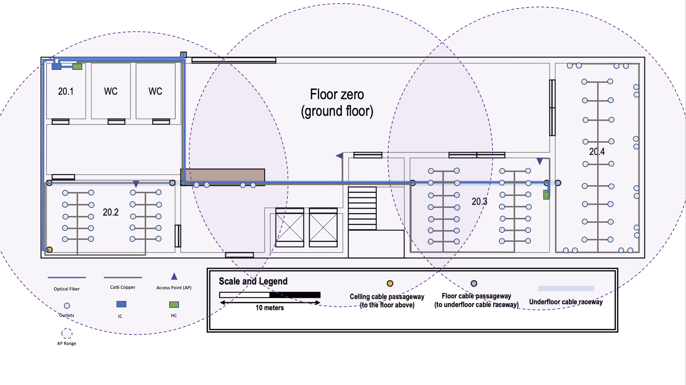
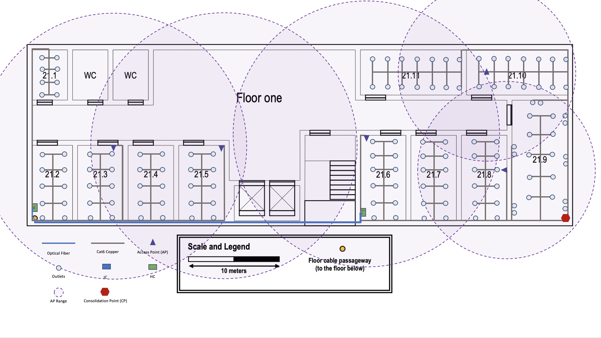

# RCOMP 2020/2021 - Project - Sprint 1
## Building 2 - Floor 0:

### Area's formula to calculate the number of outlets
To calculate the number of outlets we'll need in each room, we use the following formula:

### Structured Cabling

### Room 20.1
This room is our Telecommunications Room. On it, we'll have an Intermediate Cross-Connect (IC) and one Horizontal-Cross-Connect (HC).
The IC receive optical fibre for the Main Cross-Connect (MCC) and will pass the optical fibre to the two HC. After that, both HC will pass copper cables to outlets in the floor. Also, there's no need to have outlets here.
The room's area is 19.15 m2.

### Room 20.2
This room has 89.25 m2. With that, it's possible to have 20 outlets using the formula above.
In this room we'll also have an Access Point (AP).
The optical fibre will pass to the next floor through this room.

### Room 20.3
This room has an area of 126.07 m2. It'll have 28 outlets and the third AP _(the second one will be mentioned later in this document)_.
At this point, it's necessary to implement another HC that will receive the optical fibre from IC. This new HC will provide ethernet cables to the AP and to the next room.

### Room 20.4
Here we have 150.99 m2, so it means we can have 34 outlets.
In this room, like any other one, we have an outlet everywhere less than 3 meters.

### Common Areas
In this areas we implemented 4 outlets on the desk and an Access Point in the center of the floor. This way we will cover the area without Wi-Fi.

## Building 2 - Floor 1:

### Structured Cabling

### Room 21.1
With a total area of 21.07 m2 we can implement here 8 outlets.

### Room 21.2
In this room we have an area of 38.09 m2 which means that will have 10 outlets.
We also have a HC that receives optical fibre from the IC. This will connect half of the rooms in this floor and the other half will have other HC.

### Room 21.3/21.4/21.5
All of this rooms have the same area of 39.41 m2.
The room 21.3  and 21.5 will have an Access Point.
In the remaining rooms, we only have 10 outlets and nothing more.

### Room 21.6/21.7/21.8
In those we have an area of 46.45 m2 and 12 outlets.
The room 21.6 and 21.8 will have an Access Point.

### Room 21.9
Area of 81.13 m2 and 20 outlets in the middle of the room and on the walls.

### Room 21.10/21.11
With the same size, these areas have 57.15 m2 with 14 outlets each.
Room 21.10 also will have an AP.

## Intermediate Cross-Connect - IC
As mentioned earlier, the IC receives the optical fibre cable from the Main Cross-Connect.
Usually, only exists one per building and make the conection to all the HCs.

## Horizontal Cross-Connect - HC
This building has 1162.1 m2, approximately 1200 m2. One important rule tell us that the total area covered by one HC should be less than 1000 m2. So, this building will have 4 HCs, two per floor.
Other rule set that the distance between HC and outlets in straight line should be less than 80 meters. With the second HC this is assured.

## Access Points - APs
Every implemented Access Point have different channels when compared to the closer one. This way, we can avoid radio interference since the frequency signals are not that close.
The floor 0 only will have 3 APs since we have 88 outlets which means that if every user per oulet have 1 device connect through Wi-Fi should have no problem to AP handle that. So, per AP will have less than 30 devices connect.
Meanwhile, in the floor 1 the case it's different. Exists 139 outlets and if every user has a device connected to Wi-Fi, then we would need more than 3 APs. Said that, in this floor we'll implement 5 APs. 
All the APs will have the same SSID. This allow users to move between points without losing connection to the Wi-Fi.
On the floor 0 every AP will have 15 meters of radius, instead of floor 1 that will have 3 APs with 15 meters of radius and the remaining two with a 10 meters of radius.
It's important to mention **again** that every AP will be in a different channel. For example, on the floor 0 first AP will have channel 1, the second AP with channel 6 and the other with channel 11. On the next floor, the same will happen but the last 2 APs will start again with the channel 1 and 6, respectively.

## Consolidation Points - CPs
Consolidation Points give the utility of regenerate the signal to make possible reach outlets that may possible be too far away or in zones with a big amount of outlets.
We will only implement one to regenerate the signal for the rest of the outlets.

## Monomode vs. Multimode - Optical Fibre
Having in mind that the use of fibre will not be for long distances, we could choose multimode. However, the monomode offers higher data rates, immunity to dispersion and, in addition, longer cables. As the price between the two does not differ that much, we will choose the one that will give us a better data rate and less dispersion - monomode.
Due to redundancy and to prevent fibre failures, each HC will receive two optical fibre cables. With is, in the event of a problem with a cable, there will be another one in full operation.

## Copper Cable
To connect our HCs to the outlets we will use CAT7 cables. When compared to CAT6a, the use is justified, since despite having the same maximum speed, the frequency is doubled. That said, the signal will be able to pass through CAT7 cable twice as many times as it will pass through CAT6a.

## Telecommunications Enclosures
We will have in room 20.1 a **42U enclosure**. This choice already includes a possible addition of servers and/or connections. In addition to the IC and HC, only 1U for the fibre patch panel (24 ports), 1U for the copper patch panel (24 ports) and 2U for the copper patch panel (48 ports) will be used.

The next HC (room 20.3) will have a fibre patch panel (24 ports) and a copper patch panel (48 ports). This will occupy 3U and therefore we have opted for a smaller enclosure of only **12U**.

Upstairs, one HC will have 1 fibre patch panel (24 ports), 1 copper patch panel (48 ports) and 1 copper patch panel with only 24 ports. With a total of 4U we'll have a **26U enclosure**.

The last HC will have a fibre patch panel (24 ports) and 2 copper patch panels (24 ports and 48 ports). Both will have 4U occupied. As before, 26U enclosure is recommended.
Finally, for Consolidation Point, only a 48-port copper patch panel (2U) is required. For this last one, a **12U enclosure** is sufficient.

The rule to multiply the space occupied by 4 will be followed so that there is a possibility of expansion in the company.

## Dimensions
|      Room      | Length | Width |  Area  | Outlets |
|:--------------:|:------:|:-----:|:------:|:-------:|
|      20.1      |  5.36  |  3.57 |  19.14 |   ---   |
|      20.2      |  12.5  |  7.14 |  89.25 |    20   |
|      20.3      |  13.57 |  9.29 | 126.07 |    28   |
|      20.4      |  19.21 |  7.86 | 150.99 |    34   |
|      21.1      |  5.36  |  3.93 |  21.07 |    8    |
|      21.2      |  8.21  |  4.64 |  38.09 |    10   |
| 21.3/21.4/21.5 |  8.21  |  4.8  |  39.41 |    10   |
| 21.6/21.7/21.8 |  9.29  |   5   |  46.45 |    12   |
|      21.9      |  13.3  |  6.1  |  80.19 |    20   |
|   21.10/21.11  |  11.43 |   5   |  57.15 |    14   |

## Inventory
#### Floor 0:
- IC
- 2 HC:
	- 2 Patch Panels (Optical Fibre) with 24 ports each
	- 2 Patch Panels (Coppper) with 48 ports each
	- 1 Patch Panels (Copper) with 24 ports each
- 3 Access Points
- Optical Fibre Cable: 75.36 meters ≈ 76 meters * 2 = 152 meters
- Copper Cable: 3781.03 meters ≈ 3782 meters
- 88 outlets (including APs)
- 88 Patch Cords
- Cable trunk: 168.35 meters ≈ 169 meters
- 42U Enclosure
- 12U Enclosure
 
#### Floor 1:
- 2 HC:
	- 2 Patch Panels (Optical Fibre) with 24 ports each
	- 2 Patch Panels (Coppper) with 48 ports each
	- 2 Patch Panels (Coppper) with 24 ports each
- Consolidation Point:
	- 1 Patch Panel (Copper) with 48 ports each
- 5 Access Points
- Optical Fibre Cable: 88 meters * 2 = 176 meters
- Copper Cable: 3518.93 meters ≈ 3519 meters
- 139 outlets (including APs)
- 139 Patch Cords
- Cable trunk: 208.21 meters ≈ 209 meters
- Cable tray: 36.43 meters ≈ 37 meters
- 26U Enclosure
- 12U Enclosure

## Prices
- Patch Panel (Fibre):
	- 24 ports: 70€ * 4 = 280€
- Patch Panel (Copper):
	- 24 ports: 30€ * 3 = 90€
	- 48 ports: 70€ * 5 = 350€
- CAT7 - Copper Cable:
	- 1 meter: 2€ * 7301 meters = 14.602€
- Optical Fibre Monomode:
	- 1 meter: 5.5€ * 328 = 1804€
- 42U Enclosure: ≈ 1500€
- 26U Enclosure: ≈ 700€
- 12U Enclosure: ≈ 200€ * 2 = 400€ 

**Total:** 19.726€

######Tiago Pinto - 1200626 - 2DN - RCOMP 2020/2021 - Project - Sprint A