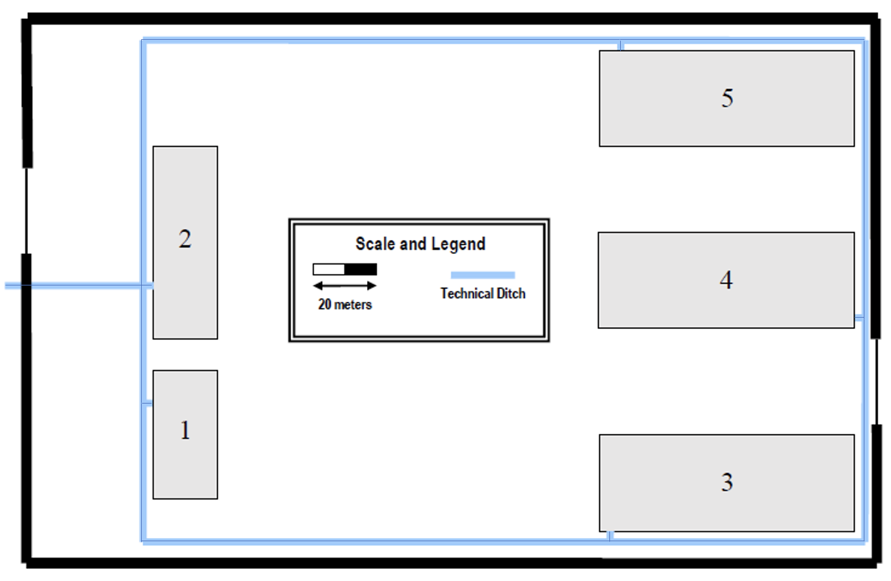

# RCOMP-20-21-DN-G2 - Sprint 1

O edifício A é o edifício central de onde saem todas as ligações de fibra para os restantes edifícios.
Todos os restantes edifícios estarão ligados entre si para que, no caso de ocorrer uma falha, haja diferentes caminhos possíveis. Desta forma, garantimos redundância.

# Edifício 1
## INVENTÁRIO DO PISO 0 ##

--> 20 metros de cabo de fibra ótica monomodo; 

--> 600 metros de cabo CAT6;

--> 3 access points;

--> 1 horizontal cross-connect;

--> 1 patch pannel de 48 portas para as salas 10.1 e 10.2;

--> 1 patch pannel de 24 portas para a sala 10.3(balcão);

## INVENTÁRIO DO PISO 1

--> 25 metros de cabo de fibra ótica monomodo; 
--> 3500 metros de cabo CAT6; 
--> 3 access points;
--> 1 horizontal cross-connect;
--> 1 patch pannel de 24 portas para a sala 11.3;
--> 1 patch pannel de 48 portas para as salas 11.2 e 11.4;
--> 1 intermediate cross connect;
--> 1 main cross connect;

# Edifício 2
## Inventory
#### Floor 0:
- IC
- 2 HC:
	- 2 Patch Panels (Optical Fibre) with 24 ports each
	- 2 Patch Panels (Coppper) with 48 ports each
	- 1 Patch Panels (Copper) with 24 ports each
- 3 Access Points
- Optical Fibre Cable: 75.36 meters ≈ 76 meters * 2 = 152 meters
- Copper Cable: 3781.03 meters ≈ 3782 meters
- 88 outlets (including APs)
- 88 Patch Cords
- Cable trunk: 168.35 meters ≈ 169 meters
- 42U Enclosure
- 12U Enclosure
 
#### Floor 1:
- 2 HC:
	- 2 Patch Panels (Optical Fibre) with 24 ports each
	- 2 Patch Panels (Coppper) with 48 ports each
	- 2 Patch Panels (Coppper) with 24 ports each
- Consolidation Point:
	- 1 Patch Panel (Copper) with 48 ports each
- 5 Access Points
- Optical Fibre Cable: 88 meters * 2 = 176 meters
- Copper Cable: 3518.93 meters ≈ 3519 meters
- 139 outlets (including APs)
- 139 Patch Cords
- Cable trunk: 208.21 meters ≈ 209 meters
- Cable tray: 36.43 meters ≈ 37 meters
- 26U Enclosure
- 12U Enclosure

# Edifício 3
## INVENTÁRIO DO PISO 0

--> 17.8 metros de cabo de fibra ótica monomodo; 

--> 20841 metros de cabo CAT6A;

--> 12 access points;

--> 3 horizontal cross-connect;

--> 1 intermediate cross connect;

--> 1 patch pannel de 48 portas para as salas 30.1 e 30.2 e 30.3;

--> 1 patch pannel de 48 portas para as salas 30.4 e 30.5;

--> 7 patch pannel de 48 portas e 1 patch pannel de 24 portas para o lado direito;

## INVENTÁRIO DO PISO 1

--> 2.9 metros de cabo de fibra ótica monomodo; 

--> 1662.5 metros de cabo CAT6A; 

--> 4 access points;

--> 1 horizontal cross-connect;

--> 1 patch pannel de 48 portas para as salas 31.1, 31.2, 31.3 e 31.4;

--> 1 patch pannel de 48 portas para as salas 31.4 e 31.5;

# Edifício 4
## INVENTÁRIO DO PISO 0 ##

--> 144 metros de cabo de fibra ótica monomodo; 

--> 9968.14 metros de cabo CAT7;

--> 14 access points;

--> 3 horizontal cross-connect;

--> 1 intermediate cross connect;

--> 1 patch panel de 48 portas para as salas 40.1 e 40.2;

--> 1 patch panel de 48 portas para as salas 40.3 e 40.4;

--> 8 patch panel de 48 portas para o lado direito;

## INVENTÁRIO DO PISO 1 ##

--> 2.4 metros de cabo de fibra ótica monomodo;
 
--> 1118.8 metros de cabo CAT7; 

--> 2 access points;

--> 1 horizontal cross-connect;

--> 1 patch panel de 48 portas para as salas 40.1 e 40.2;

--> 1 patch panel de 48 portas para as salas 40.3 e 40.4;